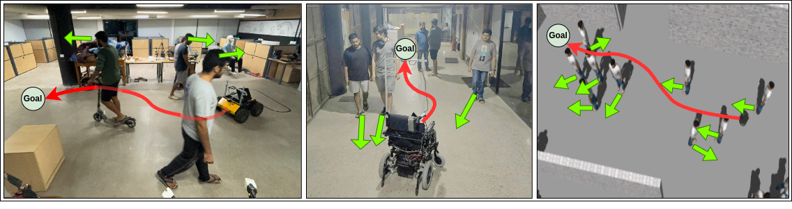

# CrowdSurfer: Sampling Optimization Augmented with Vector-Quantized Variational AutoEncoder for Dense Crowd Navigation

**Contributors:** Naman Kumar*<sup>1</sup>, Antareep Singha*<sup>1</sup>, Laksh Nanwani\*<sup>1</sup>, Dhruv Potdar<sup>1</sup>, Tarun R.<sup>1</sup>, Fatemeh Rastgar<sup>2</sup>, Simon Idoko<sup>2</sup>, Arun Kumar Singh<sup>2</sup>, K. Madhava Krishna<sup>1</sup>

<sup>1</sup>_Robotics Research Center, IIIT Hyderabad_; <sup>2</sup>_University of Tartu, Estonia_

\* denotes equal contribution

Accepted at **IEEE International Conference on Robotics and Automation (ICRA) 2025**

[Paper](https://arxiv.org/abs/2409.16011) | [Video](https://youtu.be/BMDCYdxfaXM) | [Website](https://smart-wheelchair-rrc.github.io/CrowdSurfer-webpage/)



## Abstract

Navigation amongst densely packed crowds remains a challenge for mobile robots. The complexity increases further if the environment layout changes making the prior computed global plan infeasible. In this paper, we show that it is possible to dramatically enhance crowd navigation by just improving the local planner. Our approach combines generative modelling with inference time optimization to generate sophisticated long-horizon local plans at interactive rates. More specifically, we train a Vector Quantized Variational AutoEncoder to learn a prior over the expert trajectory distribution conditioned on the perception input. At run-time, this is used as an initialization for a sampling-based optimizer for further refinement. Our approach does not require any sophisticated prediction of dynamic obstacles and yet provides state-of-the- art performance. In particular, we compare against the recent DRL-VO approach and show a 40% improvement in success rate and a 6% improvement in travel time.

## Overview

This repository contains the code for the paper "CrowdSurfer: Sampling Optimization Augmented with Vector-Quantized Variational AutoEncoder for Dense Crowd Navigation".

All configuration is done via [this configuration file](./src/CrowdSurfer/configuration/configuration.yaml).

## Installation (Prerequisites - ROS1 Noetic, Miniconda, Cuda 11.8)

```
conda create -n crowdsurfer python=3.8 -y
conda activate crowdsurfer
```

### Install the repo dependencies (tested with Cuda 11.8)
```
pip install open3d
pip install jax==0.2.20 jaxlib==0.3.2+cuda11.cudnn82 -f https://storage.googleapis.com/jax-releases/jax_cuda_releases.html
pip install networkx==3.1
pip install torch torchvision torchaudio --index-url https://download.pytorch.org/whl/cu118
pip install hydra-core
pip install accelerate
```

### Setting up the repository and simulation (ROS1 Noetic)

Running the simulation in Gazebo requires pedsim_ros (to simulate the humans).
To install pedsim_ros and other dependencies, proceed as follows:
The default version is ROS Noetic.

**Simulation Dependencies**
```
mkdir -p crowdsurfer_ws/src && cd crowdsurfer_ws/src
git clone https://github.com/TempleRAIL/robot_gazebo.git
git clone https://github.com/Smart-Wheelchair-RRC/pedsim_ros_with_gazebo.git
wget https://raw.githubusercontent.com/zzuxzt/turtlebot2_noetic_packages/master/turtlebot2_noetic_install.sh
sudo sh turtlebot2_noetic_install.sh
```

**Clone our repo**
```
git clone https://github.com/Smart-Wheelchair-RRC/CrowdSurfer.git
```

**Building the workspace**
```
cd ..
rosdep install --from-paths src --ignore-src -r -y
catkin_make
source devel/setup.bash
```

### Downloading the checkpoints
**To the Default Path** -
```
cd src/CrowdSurfer/src/CrowdSurfer && mkdir checkpoints
pip install gdown
gdown https://drive.google.com/drive/folders/1HSRrbuwwNk9_C1WKN9qnStjemFLukO8s -O checkpoints --folder
cd ../../..
```

**To a Custom Path** -

Download checkpoints from [the drive link](https://drive.google.com/drive/folders/1HSRrbuwwNk9_C1WKN9qnStjemFLukO8s)

Replace the checkpoint paths for VQVAE and PixelCNN in the [configuration file](./src/CrowdSurfer/configuration/configuration.yaml)

## Running the Demo

From within crowdsurfer_ws/ in tmux, run:

```bash
bash src/CrowdSurfer/src/CrowdSurfer/run_CrowdSurfer.sh
```
