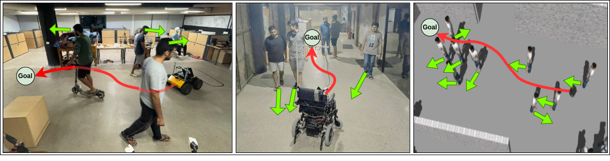

# CrowdSurfer: Sampling Optimization Augmented with Vector-Quantized Variational AutoEncoder for Dense Crowd Navigation

**Contributors:** Naman Kumar*1, Antareep Singha*1, Laksh Nanwani\*1, Dhruv Potdar1, Tarun R.1, Fatemeh Rastgar2, Simon Idoko2, Arun Kumar Singh2, K. Madhava Krishna1

1_Robotics Research Center, IIIT Hyderabad_; 2_University of Tartu, Estonia_

\*Equal Contribution

[Paper](https://arxiv.org/abs/2409.16011) | [Video](https://youtu.be/BMDCYdxfaXM) | [Website](https://smart-wheelchair-rrc.github.io/CrowdSurfer-webpage/)

## Abstract

Navigation amongst densely packed crowds remains a challenge for mobile robots. The complexity increases further if the environment layout changes making the prior computed global plan infeasible. In this paper, we show that it is possible to dramatically enhance crowd navigation by just improving the local planner. Our approach combines generative modelling with inference time optimization to generate sophisticated long-horizon local plans at interactive rates. More specifically, we train a Vector Quantized Variational AutoEncoder to learn a prior over the expert trajectory distribution conditioned on the perception input. At run-time, this is used as an initialization for a sampling-based optimizer for further refinement. Our approach does not require any sophisticated prediction of dynamic obstacles and yet provides state-of-the- art performance. In particular, we compare against the recent DRL-VO approach and show a 40% improvement in success rate and a 6% improvement in travel time.

## Overview

This repository contains the code for the paper "CrowdSurfer: Sampling Optimization Augmented with Vector-Quantized Variational AutoEncoder for Dense Crowd Navigation".

The code is divided into 3 main scripts: [`main.py`](./main.py), [`process_bags.py`](./process_bags.py), and [`ros_interface.py`](./ros_interface.py).
All configuration is done via [this configuration file](./configuration/configuration.yaml).

To run once setup, use this [script](./run_CrowdSurfer.sh) to run the code in a tmux session.

## Modes

1. TRAIN_VQVAE
2. TRAIN_PIXELCNN
3. TRAIN_SCORING_NETWORK
4. INFERENCE_VQVAE
5. INFERENCE_PIXELCNN
6. INFERENCE_COMPLETE
7. VISUALIZE

## INFERENCE_COMPLETE

Runs the entire pipeline in open loop and saves the visualization in the output directory. To run this configuration, please make the following changes:

1. Provide the full path for the best checkpoints of both models (VQVAE and PixelCNN).

    - You might have to add "pytorch_model.bin" at the end depending upon the version of HF Accelerator you are using.

2. Specify the dataset path.

    - The bag file you want to inference on must be processed using the processing function (Run `process_bags.py`).
    - Additionally, make sure that the processed bag file along with the `index.txt` is in a folder called "inference".

3. You have a choice of using PROJECTION or PRIEST in the "projection" section.

    - Select the number of iterations.
    - If you want the projection guidance to take into account obstacle constraints, set "use_obstacle_constraints" as true.

4. The mode has to be set as "INFERENCE_COMPLETE".

5. Set "visualize" as true.

6. After making changes in the YAML file, simply run `main.py` present in the root folder.

7. Look for the outputs in `./outputs`.

## VISUALIZE

This mode visualizes the processed dataset.

1. Set the mode as "VISUALIZE".
2. Set the dataset path, and coefficient configuration.
3. Put processed bag files in a folder called `inference`. The auto generated `index.txt` should also be present in the folder.

---

Note: This README is a work in progress, and information about other modes will be added soon.